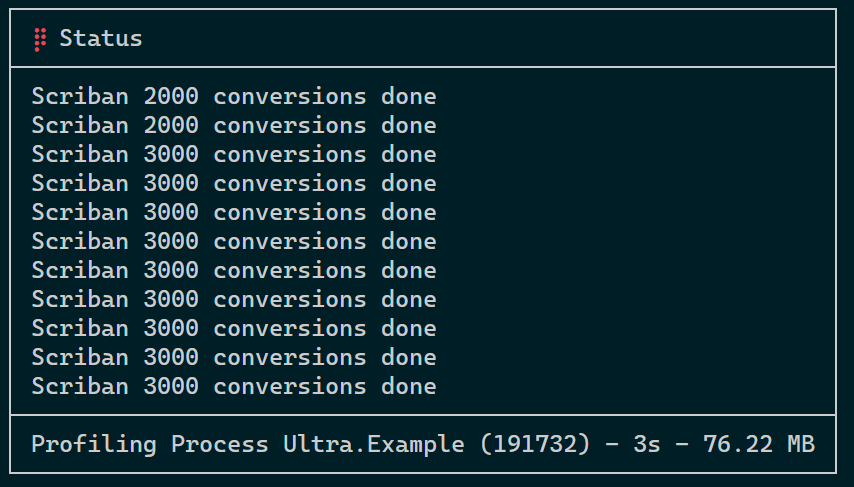
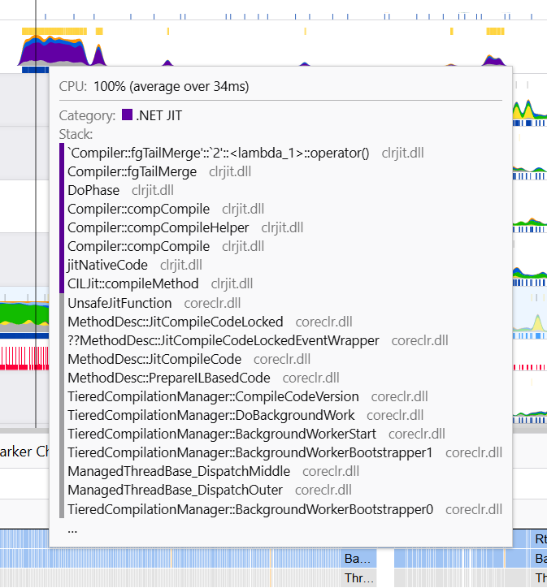
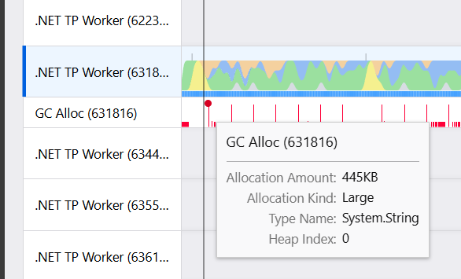

# Ultra User Guide

## Quick Start

> ____
> 🚨 The profiler **requires to run from an elevated prompt with administrative rights** 🚨 
>
> _This is required to allow to collect full stack traces, including kernel and native functions._
> ____

Example: open a **terminal with administrative rights**, to profile an executable called `my_commands.exe`:

```console
$ ultra.exe profile -- my_command.exe arg0 arg1 arg2...
```

This will create a `ultra_my_command_..._.json.gz` trace file in the current directory.

By default, ultra won't show the stdout/stderr of the program launched. You can change this behavior by specifying the `--mode` option:

- `silent` (default): won't mix program's output
- `raw`: will mix ultra and program output together in a raw output. Ultra output will be prefixed at the start of a line with `>>ultra::`
- `live`: will mix ultra and program output within a live table

For example, a profile with `live` mode:

```console
$ ultra.exe profile --mode live -- my_command.exe arg0 arg1 arg2...
```

will display the following live table when running your process:



When attaching an existing process, you can pass directly a PID to ultra.exe:

```console
$ ultra.exe profile 12594 # PID of the process to profile
```

> ⚠️ You will need to press only once `CTRL+C` to stop the profiling - or if the application is closed.


## Ultra Profiler UI

In order to visualize a trace produced by `ultra.exe` you need to go to https://profiler.firefox.com/ and open the generated `json.gz` trace file.

> :notebook: **Note**
> 
> When loading a trace with the Firefox Profiler, the trace won't be uploaded to a server but only processed locally in your browser, so **the UI is completely offline**.
> 
> It is only if you want to share the trace with a link that it will upload it to a server. But you can also share the trace file directly.

### Timeline

This screenshot shows a profile captured with ultra and is available online [here](https://share.firefox.dev/3Cya7YW)

You have access to several capabilities:
- Zoom in a timeline
- When in the Flame Graph / Stack Chart, you can hold `SHIFT + MouseWheel` to zoom-in / zoom-out


### Flame Graph / Stack Chart

The Flame Graph / Stack Chart is a visualization of the time spent in functions. The width of the boxes is proportional to the time spent in the function. The boxes are stacked to show the call hierarchy.


### Categories

When selecting functions, you can visualize the split between the time in the different modules:

- `.NET`: Managed code (user or BCL)
- `.NET JIT`: Functions participating in the JIT to compile methods
- `.NET GC`: Functions participating in the GC
- `.NET CLR`: Functions used by the CoreCLR runtime
- `Native`: Native functions
- `Kernel`: Kernel functions - displayed with hexadecimal address

The colors are reflected in the Flame Graph / Stack Chart to easily spot the different usage.


While hovering the mouse over a function, you can see the time spent in the function and the categories:

Here is an example of a function in the `JIT` category:




Here is an example of a function in the `GC` category:


### Memory Track

The memory track shows the managed memory usage of the process. You can see the memory usage over time.


### GC Allocation Track

The GC Allocation Track shows the allocation rate of the process. You can see the allocation rate over time.



### JIT and GC Markers

The JIT and GC markers are displayed in the timeline. You can see the JIT and GC events in the timeline.

You can also see them in the Marker Chart and Marker Table view.


## Ultra Command Line

ultra.exe command line options:

```console
Usage: ultra [Options] command

  -h, -?, --help                    Show this message and exit
  -v, --version                     Show the version of this command
      --verbose                     Display verbose progress

Available commands:
  profile                           Profile a new process or attach to an existing process
  convert                           Convert an existing ETL file to a Firefox Profiler json file
```

### Profile

This is the main command to profile an application - Only working within an elevated prompt:

```console
Usage: ultra profile [Options] <pid | -- execName arg0 arg1...>

  -h, -?, --help                    Show this message and exit
  -o, --output=FILE                 The base output FILE name. Default is ultra_<process_name>_yyyy-MM-dd_HH_mm_ss.
      --pid=PID                     The PID of the process to attach the profiler to.
      --sampling-interval=VALUE     The VALUE of the sample interval in ms. Default is 8190Hz = 0.122ms.
      --symbol-path=VALUE           The VALUE of symbol path. The default value is `;SRV*C:\Users\alexa\AppData\
                                      Local\Temp\SymbolCache*https://msdl.microsoft.com/download/symbols;SRV*C:\
                                      Users\alexa\AppData\Local\Temp\SymbolCache*https://symbols.nuget.org/download/
                                      symbols`.
      --paused                      Launch the profiler paused and wait for SPACE or ENTER keys to be pressed.
      --keep-merged-etl-file        Keep the merged ETL file.
      --keep-intermediate-etl-files Keep the intermediate ETL files before merging.
      --mode=VALUE                  Defines how the stdout/stderr of a program explicitly started by ultra should be
                                      integrated in its output. Default is `silent` which will not mix program's
                                      output. The other options are: `raw` is going to mix ultra and program output
                                      together in a raw output. `live` is going to mix ultra and program output
                                      within a live table.
```

### Convert

Convert an existing ETL file to a Firefox Profiler json file:

It requires a list of PID in order to only produce results for these processes. 

```console
Usage: ultra convert --pid xxx <etl_file_name.etl>

  -h, -?, --help                    Show this message and exit
  -o, --output=FILE                 The base output FILE name. Default is the input file name without the extension.
      --pid=PID                     The PID of the process
      --symbol-path=VALUE           The VALUE of symbol path. The default value is `;SRV*C:\Users\alexa\AppData\
                                      Local\Temp\SymbolCache*https://msdl.microsoft.com/download/symbols;SRV*C:\
                                      Users\alexa\AppData\Local\Temp\SymbolCache*https://symbols.nuget.org/download/
                                      symbols`.
```
