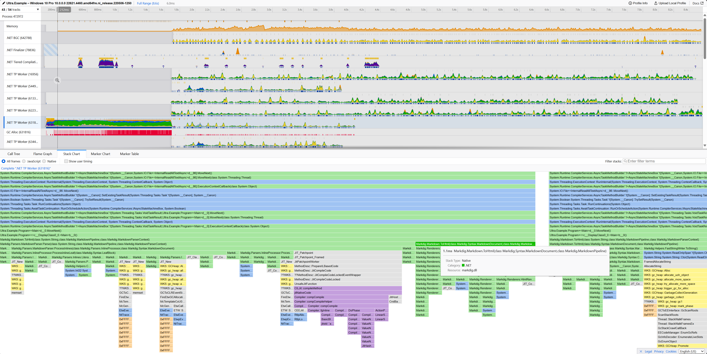

# Ultra [](https://github.com/xoofx/ultra/actions/workflows/ci.yml) [](https://www.nuget.org/packages/Ultra/)


Ultra is a an advanced profiler for .NET Applications available on Windows.

## ✨ Features

- ETW based **sampling profiler** - up to 8190 samples/second
- UI based on https://profiler.firefox.com/
  - Traces shareable online: Check this example: ✨ https://share.firefox.dev/3Cya7YW ✨
  - **Timeline** visualization
  - **Flamegraph / Stack Chart** visualization
  - **Call Tree** visualization
  - **Marker Chart** and **Marker Table** visualization  
- Precise **kernel**, **native** and **managed** **function call stacks**
- Categorization of functions: 
  - `.NET`, `.NET JIT`, `.NET GC`, `.NET CLR`, `Native`, `Kernel`
- .NET GC Memory track
- JIT Compile Time Event Markers
  - See which function is getting compiled
- GC Events Markers
  - `GC Allocation Ticks`: Details about allocations. 
  - `GCHeapStats`: Statistics about the GC
  - `GCSuspendEE`, `GCRestartEE`, `GC Start`, `GC Stop` events
- Lightweight trace files - e.g. Generates only a few MB for 10s
- Requires `net8.0+` via dotnet global tool

|Screenshot of a trace generated by ultra visualized with https://profiler.firefox.com. Check this trace online [here](https://share.firefox.dev/3Cya7YW)! |
|-----|
||

## 🧑‍💻 Usage

You need to have installed a [.NET 8.0+ SDK](https://dotnet.microsoft.com/en-us/download/dotnet/8.0)

```console
$ dotnet tool install -g Ultra # The command ultra.exe will be available from your PATH
```

> ____
> 🚨 The profiler **requires to run from an elevated prompt with administrative rights** 🚨 
>
> _This is required to allow to collect full stack traces, including kernel and native functions._
> ____

Example: open a **terminal with administrative rights**, to profile an executable called `my_commands.exe`:

```console
$ ultra.exe profile -- my_command.exe arg0 arg1 arg2...
```

> ⚠️ Notice the `--` separator to separate the arguments to `ultra.exe` from the arguments to the profiled application.

Profiling a running application just requires the PID of the process to profile:

```console
$ ultra.exe profile 15243 # PID of the process to profile
```

## 📖 User Guide

For more details on how to use Ultra, please visit the [user guide](https://github.com/xoofx/Ultra/blob/main/doc/readme.md).

## 🪪 License

This software is released under the [BSD-2-Clause license](https://opensource.org/licenses/BSD-2-Clause). 

## 🤗 Author

Alexandre Mutel aka [xoofx](https://xoofx.github.io).
